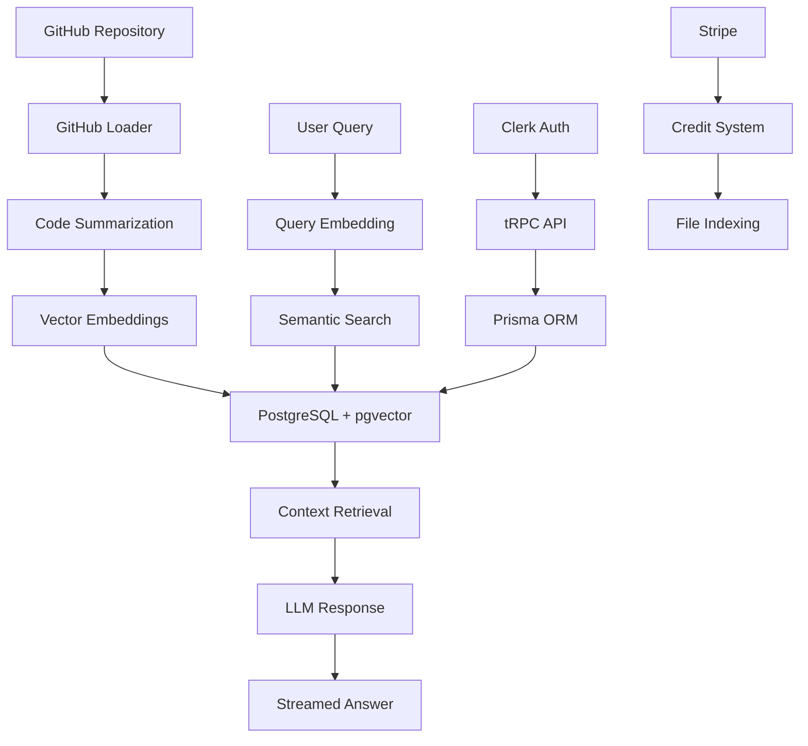

# 🚀 Gittacharya - AI-Powered Codebase Intelligence

> **"From Git to Guru"** - Transform any GitHub repository into an intelligent, searchable knowledge base with AI-powered insights.


## 🌟 What is Gittacharya?

Gittacharya is a sophisticated **full-stack SaaS application** that transforms GitHub repositories into intelligent, searchable knowledge bases. Using cutting-edge **Retrieval-Augmented Generation (RAG)** technology, it enables developers to have natural language conversations with their codebase, making onboarding, code reviews, and knowledge sharing effortless.

### 🎯 Key Features

- **🤖 AI-Powered Q&A**: Ask questions about your codebase in plain English
- **📚 RAG Implementation**: Semantic search through vector embeddings
- **🔄 Real-time Sync**: Automatic GitHub commit tracking and indexing
- **👥 Team Collaboration**: Multi-user project management
- **💰 Credit System**: Pay-per-file indexing with Stripe integration
- **🎪 Meeting Management**: Code-focused discussion tracking
- **📊 Analytics Dashboard**: Project insights and commit history

## 🏗️ Architecture Overview



## 🧠 RAG Implementation Deep Dive

### 1. **Document Processing Pipeline**
```typescript
// src/lib/github-loader.ts
const docs = await loadGithubRepo(githubUrl, githubToken)
const allembeddings = await generateEmbeddings(docs)
```

### 2. **Intelligent Code Summarization**
```typescript
// src/lib/gemini.ts
export const summariseCode = async (doc: Document) => {
    const code = doc.pageContent.slice(0, 10000)
    const response = await model.generateContent([
        `You are an intelligent senior software engineer who specialises in onboarding junior software engineers onto projects...`
    ])
    return response.response.text()
}
```

### 3. **Vector Embedding Generation**
```typescript
export const generateEmbedding = async (summary: string) => {
    const model = genAI.getGenerativeModel({
        model: 'text-embedding-004'
    })
    const result = await model.embedContent(summary)
    return result.embedding.values
}
```

### 4. **Semantic Search & Context Retrieval**
```sql
-- PostgreSQL with pgvector extension
SELECT "fileName", "sourceCode", "summary",
1 - ("summaryEmbedding" <=> $1::vector) AS similarity
FROM "SourceCodeEmbedding"
WHERE "projectId" = $2
ORDER BY similarity DESC
LIMIT 10
```

### 5. **AI-Powered Response Generation**
```typescript
// src/app/(protected)/dashboard/actions.ts
const { textStream } = await streamText({
    model: google('gemini-1.5-flash'),
    prompt: `You are an AI code assistant who answers questions about the codebase...
    CONTEXT: ${context}
    QUESTION: ${question}`
})
```

## 🛠️ Technology Stack

### **Frontend**
- **Next.js 15** - React framework with App Router
- **TypeScript** - Type-safe development
- **Tailwind CSS** - Utility-first styling
- **Shadcn/ui** - Modern component library
- **React Hook Form** - Form management
- **Sonner** - Toast notifications

### **Backend**
- **tRPC** - End-to-end type-safe APIs
- **Prisma** - Type-safe database ORM
- **PostgreSQL** - Primary database
- **pgvector** - Vector similarity search
- **Clerk** - Authentication & user management

### **AI & ML**
- **Google Gemini** - Large Language Model
- **LangChain** - Document processing
- **Vector Embeddings** - Semantic search
- **AI SDK** - Streaming responses

### **Integrations**
- **GitHub API** - Repository analysis
- **Stripe** - Payment processing
- **Octokit** - GitHub API client
- **AssemblyAI** - Audio processing

### **DevOps & Tools**
- **Vercel** - Deployment platform
- **ESLint** - Code linting
- **Prettier** - Code formatting
- **Turbo** - Build optimization

## 🚀 Getting Started

### Prerequisites
- Node.js 18+
- PostgreSQL with pgvector extension
- GitHub token
- Google Gemini API key
- Stripe account

### Installation

```bash
# Clone the repository
git clone https://github.com/yourusername/gittacharya.git
cd gittacharya

# Install dependencies
npm install

# Set up environment variables
cp .env.example .env.local

# Configure your .env.local
DATABASE_URL="postgresql://..."
GEMINI_API_KEY="your-gemini-key"
GITHUB_TOKEN="your-github-token"
NEXT_PUBLIC_CLERK_PUBLISHABLE_KEY="your-clerk-key"
CLERK_SECRET_KEY="your-clerk-secret"
STRIPE_SECRET_KEY="your-stripe-secret"

# Set up database
npm run db:push
npm run db:generate

# Start development server
npm run dev
```

## 🎯 Core Features Breakdown

### 1. **Repository Indexing**
- Automatic file discovery and content extraction
- Intelligent code summarization using AI
- Vector embedding generation for semantic search
- Credit-based pricing model

### 2. **AI-Powered Q&A**
- Natural language query processing
- Context-aware response generation
- Real-time streaming responses
- File reference tracking

### 3. **Team Collaboration**
- Multi-user project access
- Invite system with secure links
- Role-based permissions
- Shared knowledge base

### 4. **Meeting Management**
- Code-focused discussion tracking
- AI-generated meeting summaries
- Issue identification and tracking
- Team productivity insights

## 🔧 Database Schema

```prisma
model SourceCodeEmbedding {
    id        String  @id @default(cuid())
    summaryEmbedding Unsupported("vector(768)")?
    sourceCode  String
    fileName String
    summary  String
    projectId String
    project Project @relation(fields: [projectId], references: [id])
}
```

## 🌊 API Flow

### Question Processing Flow
1. **User Query** → Embedding Generation
2. **Vector Search** → Top-K Similar Documents
3. **Context Assembly** → Relevant Code Snippets
4. **LLM Processing** → AI-Generated Response
5. **Streaming Response** → Real-time User Experience

## 📊 Performance Optimizations

- **Parallel Processing**: Concurrent embedding generation
- **Streaming Responses**: Real-time AI output
- **Vector Indexing**: Fast similarity search
- **Caching Strategy**: Optimized database queries
- **Lazy Loading**: Efficient component rendering

## 🎨 UI/UX Highlights

- **Modern Design**: Clean, professional interface
- **Responsive Layout**: Mobile-first approach
- **Dark Mode**: Eye-friendly development experience
- **Interactive Components**: Smooth user interactions
- **Loading States**: Excellent user feedback

## 🔒 Security Features

- **Authentication**: Clerk-based user management
- **Authorization**: Role-based access control
- **Data Privacy**: Secure token handling
- **Input Validation**: Comprehensive data sanitization
- **Rate Limiting**: API abuse prevention

## 📈 Scalability Considerations

- **Database Indexing**: Optimized query performance
- **Connection Pooling**: Efficient database connections
- **Caching Layer**: Redis for frequently accessed data
- **CDN Integration**: Fast asset delivery
- **Horizontal Scaling**: Stateless architecture

## 🎯 Future Enhancements

- [ ] **Multi-language Support**: Python, Java, Go analysis
- [ ] **Advanced Analytics**: Code quality metrics
- [ ] **IDE Integration**: VS Code extension
- [ ] **Slack/Discord Bots**: Team chat integration
- [ ] **API Documentation**: OpenAPI spec generation
- [ ] **Code Generation**: AI-powered code suggestions

## 🤝 Contributing

This project showcases modern full-stack development practices and is designed to demonstrate:

- **Clean Architecture**: Separation of concerns
- **Type Safety**: End-to-end TypeScript
- **Performance**: Optimized database queries
- **Scalability**: Production-ready architecture
- **User Experience**: Intuitive interface design

## 📄 License

This project is built as a portfolio demonstration of full-stack development skills, featuring:
- Advanced RAG implementation
- Modern React/Next.js development
- Type-safe API design
- Vector database operations
- AI integration expertise

---

<div align="center">

**Built with ❤️ by a passionate Full-Stack Developer**

*Transforming repositories into intelligent knowledge bases, one commit at a time.*

</div>
